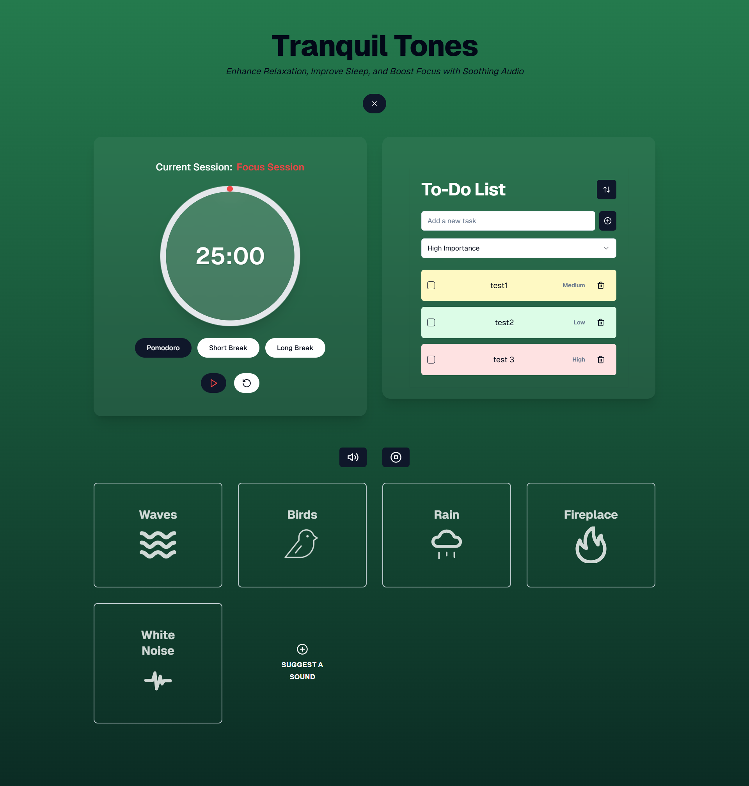

# Tranquil Tones: Your Productivity Soundscape 🧘‍♀️📝

[Live Demo](https://tranquil-tones.vercel.app/)

## Description

Unlock peak productivity and maintain a calm, focused state with Tranquil Tones. This application combines the power of ambient white noise with essential tools to streamline your workflow and enhance concentration.

## Screenshot

## Features

- **Time Management with Pomodoro:** Utilize the integrated Pomodoro timer to structure your work sessions and optimize your time.
- **Seamless Note-Taking with To-Do:** Keep your thoughts and tasks organized with the built-in To-Do component, ensuring you stay on top of your work.
- **Immersive Sound Environment:** Choose from a curated library of white noise sounds via the easy-to-use sound panel. Find the perfect soundscape to minimize distractions and enhance focus.

## License

This project is licensed under the MIT License. See the [LICENSE](LICENSE) file for more details.
